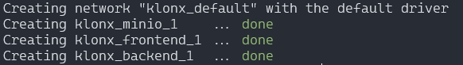
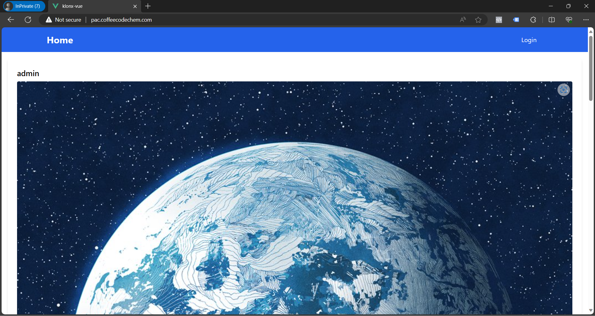
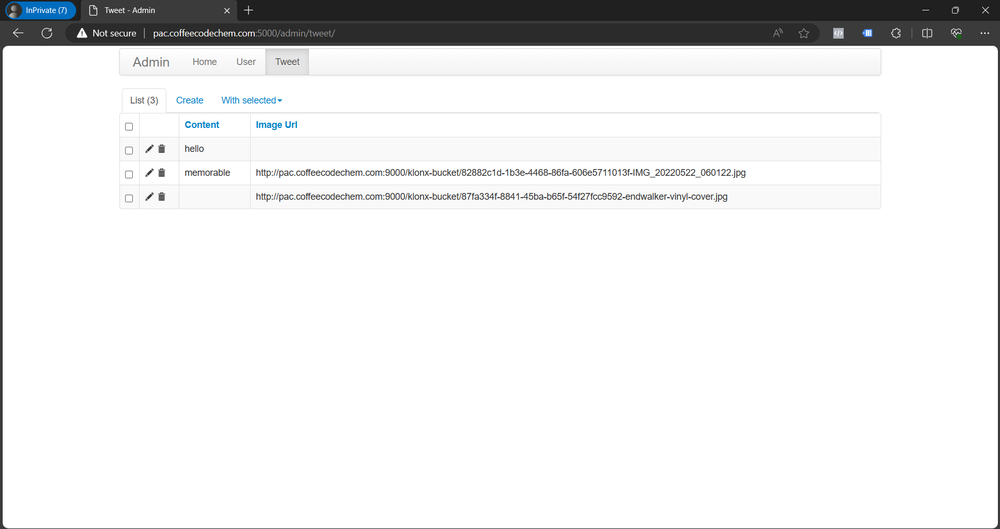

# Intro to DevOps
Keterangan untuk Evaluator dari Pacmann:
Pengerjaan project ini belum lengkap. Untuk Video di YouTube, penulis hanya memberikan live demo singkat bahwa project Twitter Clone sudah dapat diakses secara live lewat sebuah subdomain (http://pac.coffeecodechem.com). Video YouTube: https://youtu.be/BStg3k9c7_E
Untuk beberapa poin yang masih kurang:
- Tidak ada HTTPS. Sudah dicoba untuk setup tapi SSL hanya berhasil di Frontend saja, untuk port-port 5000 (Flask) dan 9000 (MinIO) belum berhasil, sehingga penulis me-revert kembali hanya dengan HTTP tanpa SSL.
- Belum diterapkan sistem CI/CD menggunakan GitHub Actions.

Catatan tambahan:
- Docker sudah diterapkan dari term sebelumnya di kelas sebelumnya.

# Persiapan server
## Update server
Sumber: [Install Docker Engine on Ubuntu | Docker Docs](https://docs.docker.com/engine/install/ubuntu/#install-using-the-repository)
```
# Add Docker's official GPG key:
sudo apt-get update
sudo apt-get install ca-certificates curl gnupg
sudo install -m 0755 -d /etc/apt/keyrings
curl -fsSL https://download.docker.com/linux/ubuntu/gpg | sudo gpg --dearmor -o /etc/apt/keyrings/docker.gpg
sudo chmod a+r /etc/apt/keyrings/docker.gpg

# Add the repository to Apt sources:
echo \
  "deb [arch=$(dpkg --print-architecture) signed-by=/etc/apt/keyrings/docker.gpg] https://download.docker.com/linux/ubuntu \
  $(. /etc/os-release && echo "$VERSION_CODENAME") stable" | \
  sudo tee /etc/apt/sources.list.d/docker.list > /dev/null
sudo apt-get update
```
### Install Docker
```
sudo apt-get install docker-ce docker-ce-cli containerd.io docker-buildx-plugin docker-compose-plugin
```
Memastikan Docker Engine terinstall
```
sudo docker run hello-world
```
Hasil:
```
Status: Downloaded newer image for hello-world:latest

Hello from Docker!
This message shows that your installation appears to be working correctly.

To generate this message, Docker took the following steps:
 1. The Docker client contacted the Docker daemon.
 2. The Docker daemon pulled the "hello-world" image from the Docker Hub.
    (amd64)
 3. The Docker daemon created a new container from that image which runs the
    executable that produces the output you are currently reading.
 4. The Docker daemon streamed that output to the Docker client, which sent it
    to your terminal.
```
### Install Nginx
```
sudo apt install nginx
```
### Konfigurasi Firewall
Cek konfigurasi Firewall yang ada.
```
sudo ufw app list
```
Men-set "allow" untuk `Nginx Full`.
```
sudo ufw allow 'Nginx Full'
```
Cek status aktif firewall.
```
sudo ufw status
```
Jika tidak aktif, aktifkan dengan:
```
sudo ufw enable
```
Memastikan service status dari Nginx.
```
sudo systemctl status nginx
```
Contoh hasil jika Nginx sudah berjalan:
```
● nginx.service - A high performance web server and a reverse proxy server
     Loaded: loaded (/lib/systemd/system/nginx.service; enabled; vendor preset: enabled)
     Active: active (running) since Sun 2024-01-07 12:49:01 UTC; 2min 10s ago
```

### Setup git repo dan jalankan docker

Pertama kita clone dua repo, [atseira/pac05a-twitter_clone_flask: Webdev Architecture Pacmann - Twitter clone | Flask (github.com)](https://github.com/atseira/pac05a-twitter_clone_flask) dan [atseira/pac05b-twitter_clone_vue: Webdev Architecture Pacmann - Twitter clone | Vue (github.com)](https://github.com/atseira/pac05b-twitter_clone_vue).

Git clone keduanya:
```
git clone https://github.com/atseira/pac05a-twitter_clone_flask.git
git clone https://github.com/atseira/pac05b-twitter_clone_vue.git
```
Untuk folder pac05a... beri nama sebagai `klonx`.
Untuk folder pac05b sebagai `klonx-vue`.

Ada beberapa penyesuaian yang perlu dilakukan, untuk CORS perlu disesuaikan dengan subdomain yang digunakan. Dalam case ini pac.coffeecodechem.com.
Lalu di dalam Project Vue, juga perlu diganti untuk semua API endpoint-nya diarahkan ke http://pac.coffeecodechem.com:5000/.

Setelah itu kita masuk ke dalam folder `klonx` (rep `pac05a-...`) dan jalankan
```
docker-compose build
```
Dan
```
docker-compose up -d
```
Untuk menjalankan server Vue, Flask, dan MinIO di port-nya masing-masing.

### Setup konfigurasi Nginx
Di dalam `/etc/nginx/sites-available` kita buat sebuah file konfigurasi, misalkan bernama `konfigwebsite.conf` sebagai berikut:
```
server {
    listen 8080;
    server_name pac.coffeecodechem.com;

   location /backend {
        proxy_pass http://127.0.0.1:5000;
        proxy_set_header Host $host;
        proxy_set_header X-Real-IP $remote_addr;
        proxy_set_header X-Forwarded-For $proxy_add_x_forwarded_for;
        proxy_set_header X-Forwarded-Proto $scheme;
    }

    location /minio {
        proxy_pass http://127.0.0.1:9000/;
        proxy_set_header Host $host;
        proxy_set_header X-Real-IP $remote_addr;
        proxy_set_header X-Forwarded-For $proxy_add_x_forwarded_for;
        proxy_set_header X-Forwarded-Proto $scheme;
    }

    location /frontend {
        proxy_pass http://127.0.0.1:8080;
        proxy_set_header Host $host;
        proxy_set_header X-Real-IP $remote_addr;
        proxy_set_header X-Forwarded-For $proxy_add_x_forwarded_for;
        proxy_set_header X-Forwarded-Proto $scheme;
    }
}
```

### Aktifkan konfigurasi website di nginx

Kita buat symbolic link dari `/etc/nginx/sites-available/konfigwebsite.conf` ke `/etc/nginx/sites-enabled/konfigwebsite.conf`

```
ln -s /etc/nginx/sites-available/konfigwebsite.conf /etc/nginx/sites-enabled/konfigwebsite.conf
```
Setelah itu kita bisa cek apakah ada error dalam konfigurasi nginx dengan:
```
sudo nginx -t
```
Jika aman, bisa kita restart nginx:
```
service nginx restart
```
Setelah itu, website sudah dapat diakses live.
Dalam case ini, website dapat diakses di http://pac.coffeecodechem.com

# Screenshot website live


